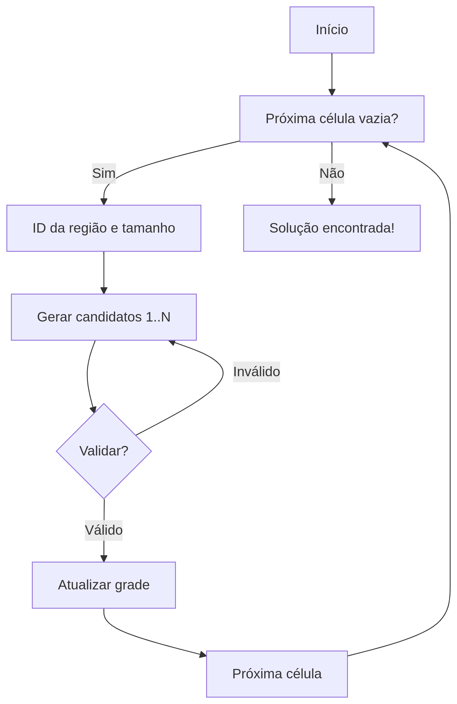

# Kojun Solvers

Repositório contendo solucionadores do puzzle **Kojun** por *backtracking* em diferentes linguagens e paradigmas, utilizados na disciplina **INE5416 - Paradigmas de Programação**.



---

## Estrutura do Repositório

* `kojun.py`
  Implementação experimental em **Python**, baseada em um vídeo de Sudoku do youtube porém adaptada para Kojun.

* `Kojun.hs`
  Implementação em **Haskell**, utilizando o paradigma Funcional.

* `KojunSolver.scala`
  Implementação em **Scala**, linguagem de livre escolha dadas as opções pelo professor, multiparadigmas, parecida com Python e Java.

* `kojun_solver.pl` 
  Implementação em **Prolog** utilizando o paradigma Lógico.

---

## Como Usar

1. **Clone** este repositório:

   ```bash
   git clone https://github.com/julianamirbosio/Kojun.git
   cd Kojun
   ```
2. **Escolha** a linguagem de sua preferência.
3. **Compile** o código seguindo as instruções comentadas no main de cada projeto.
4. **Forneça** seu tabuleiro de escolha, algumas entradas exemplo estão na pasta inputs.

---

## Recursos e Referências

* **Jogo Kojun**: [https://www.janko.at/Raetsel/Kojun/index.htm](https://www.janko.at/Raetsel/Kojun/index.htm)

* [https://codemyroad.wordpress.com/2014/05/01/solving-sudoku-by-backtracking/](https://codemyroad.wordpress.com/2014/05/01/solving-sudoku-by-backtracking/)
* [https://github.com/danieldn/haskell-sudoku-solver](https://github.com/danieldn/haskell-sudoku-solver)
* [https://youtu.be/MupEclHpobk?si=HULbyp5uGS16jnju](https://youtu.be/MupEclHpobk?si=HULbyp5uGS16jnju)
* [https://youtu.be/zIfjnX1EhpE?si=KRfl4Ortc966qWB5](https://youtu.be/zIfjnX1EhpE?si=KRfl4Ortc966qWB5)
* [https://github.com/Soul-Legend/KojunHaskell/blob/main/solver.hs](https://github.com/Soul-Legend/KojunHaskell/blob/main/solver.hs)
* [https://github.com/ErFer7/Kojun](https://github.com/ErFer7/Kojun)
* [https://youtu.be/eqUwSA0xI-s?si=\_mavYER40TlNq1eJ](https://youtu.be/eqUwSA0xI-s?si=_mavYER40TlNq1eJ)

